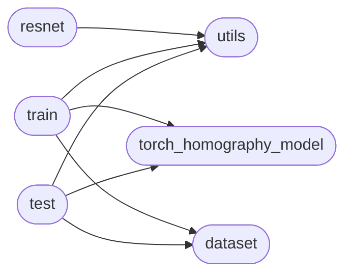

# Code Overview

[_Documentation generated by Documatic_](https://www.documatic.com)

<!---Documatic-section-Codebase Structure Python-start--->
## Codebase Structure Python

The codebase has a flat structure, with 6 code files.

<!---Documatic-block-system_architecture-start--->

<!---Documatic-block-system_architecture-end--->

# #
<!---Documatic-section-Codebase Structure Python-end--->

<!---Documatic-section-Important Functions-start--->
## Important Functions

<!---Documatic-block-important_funcs-start--->
<!---Documatic-block-most_used_funcs-start--->
### Most Utilised Functions

* Oneline-DLTv1.torch_homography_model.build_model (2 times)
* Oneline-DLTv1.utils.transform (1 times)
* Oneline-DLTv1.utils.display_using_tensorboard (1 times)
* Oneline-DLTv1.dataset.make_mesh (1 times)
* Oneline-DLTv1.utils.transformer (1 times)
<!---Documatic-block-most_used_funcs-end--->
<!---Documatic-block-important_funcs-end--->

# #
<!---Documatic-section-Important Functions-end--->

<!---Documatic-section-File IO-start--->
## File IO

<!---Documatic-block-file_io-start--->
The following files have file read operations

<!---Documatic-block-Oneline_DLTv1-start--->

	
<code>Oneline_DLTv1</code> (Click to Expand!)

* Oneline-DLTv1.dataset
* Oneline-DLTv1.test

<!---Documatic-block-Oneline_DLTv1-end--->

The following files have file write operations

<!---Documatic-block-Oneline_DLTv1-start--->

	
<code>Oneline_DLTv1</code> (Click to Expand!)

* Oneline-DLTv1.test

<!---Documatic-block-Oneline_DLTv1-end--->
<!---Documatic-block-file_io-end--->

# #
<!---Documatic-section-File IO-end--->

<!---Documatic-section-Class Hierarchy-start--->
## Class Hierarchy

<!---Documatic-block-Oneline_DLTv1.dataset.TrainDataset-start--->

	
<code>Oneline_DLTv1.dataset.TrainDataset</code> (Click to Expand!)

* Oneline-DLTv1.dataset.TestDataset
* Oneline-DLTv1.dataset.TrainDataset

<!---Documatic-block-Oneline_DLTv1.dataset.TrainDataset-end--->

<!---Documatic-block-nn.Module-start--->

	
<code>nn.Module</code> (Click to Expand!)

* Oneline-DLTv1.resnet.BasicBlock
* Oneline-DLTv1.resnet.Bottleneck
* Oneline-DLTv1.resnet.ResNet

<!---Documatic-block-nn.Module-end--->

# #
<!---Documatic-section-Class Hierarchy-end--->

[_Documentation generated by Documatic_](https://www.documatic.com)