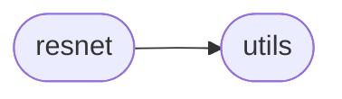

# Oneline-dltv1 Resnet

[_Documentation generated by Documatic_](https://www.documatic.com)

<!---Documatic-section-Codebase Structure-start--->
## Codebase Structure

<!---Documatic-block-system_architecture-start--->

<!---Documatic-block-system_architecture-end--->

# #
<!---Documatic-section-Codebase Structure-end--->

<!---Documatic-section-Oneline_DLTv1.resnet.create_gif-start--->
## Oneline-DLTv1.resnet.create_gif

<!---Documatic-section-create_gif-start--->
<!---Documatic-block-Oneline_DLTv1.resnet.create_gif-start--->
<details>
	<summary><code>Oneline_DLTv1.resnet.create_gif</code> code snippet</summary>

```python
def create_gif(image_list, gif_name, duration=0.35):
    frames = []
    for image_name in image_list:
        frames.append(image_name)
    imageio.mimsave(gif_name, frames, 'GIF', duration=0.5)
    return
```
</details>
<!---Documatic-block-Oneline_DLTv1.resnet.create_gif-end--->
<!---Documatic-section-create_gif-end--->

# #
<!---Documatic-section-Oneline_DLTv1.resnet.create_gif-end--->

<!---Documatic-section-Oneline_DLTv1.resnet.getPatchFromFullimg-start--->
## Oneline-DLTv1.resnet.getPatchFromFullimg

<!---Documatic-section-getPatchFromFullimg-start--->
<!---Documatic-block-Oneline_DLTv1.resnet.getPatchFromFullimg-start--->
<details>
	<summary><code>Oneline_DLTv1.resnet.getPatchFromFullimg</code> code snippet</summary>

```python
def getPatchFromFullimg(patch_size_h, patch_size_w, patchIndices, batch_indices_tensor, img_full):
    (num_batch, num_channels, height, width) = img_full.size()
    warped_images_flat = img_full.reshape(-1)
    patch_indices_flat = patchIndices.reshape(-1)
    pixel_indices = patch_indices_flat.long() + batch_indices_tensor
    mask_patch = torch.gather(warped_images_flat, 0, pixel_indices)
    mask_patch = mask_patch.reshape([num_batch, 1, patch_size_h, patch_size_w])
    return mask_patch
```
</details>
<!---Documatic-block-Oneline_DLTv1.resnet.getPatchFromFullimg-end--->
<!---Documatic-section-getPatchFromFullimg-end--->

# #
<!---Documatic-section-Oneline_DLTv1.resnet.getPatchFromFullimg-end--->

<!---Documatic-section-Oneline_DLTv1.resnet.normMask-start--->
## Oneline-DLTv1.resnet.normMask

<!---Documatic-section-normMask-start--->
<!---Documatic-block-Oneline_DLTv1.resnet.normMask-start--->
<details>
	<summary><code>Oneline_DLTv1.resnet.normMask</code> code snippet</summary>

```python
def normMask(mask, strenth=0.5):
    (batch_size, c_m, c_h, c_w) = mask.size()
    max_value = mask.reshape(batch_size, -1).max(1)[0]
    max_value = max_value.reshape(batch_size, 1, 1, 1)
    mask = mask / (max_value * strenth)
    mask = torch.clamp(mask, 0, 1)
    return mask
```
</details>
<!---Documatic-block-Oneline_DLTv1.resnet.normMask-end--->
<!---Documatic-section-normMask-end--->

# #
<!---Documatic-section-Oneline_DLTv1.resnet.normMask-end--->

<!---Documatic-section-Oneline_DLTv1.resnet.conv3x3-start--->
## Oneline-DLTv1.resnet.conv3x3

<!---Documatic-section-conv3x3-start--->
<!---Documatic-block-Oneline_DLTv1.resnet.conv3x3-start--->
<details>
	<summary><code>Oneline_DLTv1.resnet.conv3x3</code> code snippet</summary>

```python
def conv3x3(in_planes, out_planes, stride=1):
    return nn.Conv2d(in_planes, out_planes, kernel_size=3, stride=stride, padding=1, bias=False)
```
</details>
<!---Documatic-block-Oneline_DLTv1.resnet.conv3x3-end--->
<!---Documatic-section-conv3x3-end--->

# #
<!---Documatic-section-Oneline_DLTv1.resnet.conv3x3-end--->

<!---Documatic-section-Oneline_DLTv1.resnet.resnet18-start--->
## Oneline-DLTv1.resnet.resnet18

<!---Documatic-section-resnet18-start--->


### Object Calls

* Oneline-DLTv1.resnet.ResNet

<!---Documatic-block-Oneline_DLTv1.resnet.resnet18-start--->
<details>
	<summary><code>Oneline_DLTv1.resnet.resnet18</code> code snippet</summary>

```python
def resnet18(pretrained=False, **kwargs):
    model = ResNet(BasicBlock, [2, 2, 2, 2], **kwargs)
    if pretrained:
        model.load_state_dict(model_zoo.load_url(model_urls['resnet18']))
    return model
```
</details>
<!---Documatic-block-Oneline_DLTv1.resnet.resnet18-end--->
<!---Documatic-section-resnet18-end--->

# #
<!---Documatic-section-Oneline_DLTv1.resnet.resnet18-end--->

<!---Documatic-section-Oneline_DLTv1.resnet.resnet34-start--->
## Oneline-DLTv1.resnet.resnet34

<!---Documatic-section-resnet34-start--->


### Object Calls

* Oneline-DLTv1.resnet.ResNet

<!---Documatic-block-Oneline_DLTv1.resnet.resnet34-start--->
<details>
	<summary><code>Oneline_DLTv1.resnet.resnet34</code> code snippet</summary>

```python
def resnet34(pretrained=False, **kwargs):
    model = ResNet(BasicBlock, [3, 4, 6, 3], **kwargs)
    if pretrained:
        model.load_state_dict(model_zoo.load_url(model_urls['resnet34']))
    return model
```
</details>
<!---Documatic-block-Oneline_DLTv1.resnet.resnet34-end--->
<!---Documatic-section-resnet34-end--->

# #
<!---Documatic-section-Oneline_DLTv1.resnet.resnet34-end--->

<!---Documatic-section-Oneline_DLTv1.resnet.resnet50-start--->
## Oneline-DLTv1.resnet.resnet50

<!---Documatic-section-resnet50-start--->


### Object Calls

* Oneline-DLTv1.resnet.ResNet

<!---Documatic-block-Oneline_DLTv1.resnet.resnet50-start--->
<details>
	<summary><code>Oneline_DLTv1.resnet.resnet50</code> code snippet</summary>

```python
def resnet50(pretrained=False, **kwargs):
    model = ResNet(Bottleneck, [3, 4, 6, 3], **kwargs)
    if pretrained:
        model.load_state_dict(model_zoo.load_url(model_urls['resnet50']))
    return model
```
</details>
<!---Documatic-block-Oneline_DLTv1.resnet.resnet50-end--->
<!---Documatic-section-resnet50-end--->

# #
<!---Documatic-section-Oneline_DLTv1.resnet.resnet50-end--->

<!---Documatic-section-Oneline_DLTv1.resnet.resnet101-start--->
## Oneline-DLTv1.resnet.resnet101

<!---Documatic-section-resnet101-start--->


### Object Calls

* Oneline-DLTv1.resnet.ResNet

<!---Documatic-block-Oneline_DLTv1.resnet.resnet101-start--->
<details>
	<summary><code>Oneline_DLTv1.resnet.resnet101</code> code snippet</summary>

```python
def resnet101(pretrained=False, **kwargs):
    model = ResNet(Bottleneck, [3, 4, 23, 3], **kwargs)
    if pretrained:
        model.load_state_dict(model_zoo.load_url(model_urls['resnet101']))
    return model
```
</details>
<!---Documatic-block-Oneline_DLTv1.resnet.resnet101-end--->
<!---Documatic-section-resnet101-end--->

# #
<!---Documatic-section-Oneline_DLTv1.resnet.resnet101-end--->

<!---Documatic-section-Oneline_DLTv1.resnet.resnet152-start--->
## Oneline-DLTv1.resnet.resnet152

<!---Documatic-section-resnet152-start--->


### Object Calls

* Oneline-DLTv1.resnet.ResNet

<!---Documatic-block-Oneline_DLTv1.resnet.resnet152-start--->
<details>
	<summary><code>Oneline_DLTv1.resnet.resnet152</code> code snippet</summary>

```python
def resnet152(pretrained=False, **kwargs):
    model = ResNet(Bottleneck, [3, 8, 36, 3], **kwargs)
    if pretrained:
        model.load_state_dict(model_zoo.load_url(model_urls['resnet152']))
    return model
```
</details>
<!---Documatic-block-Oneline_DLTv1.resnet.resnet152-end--->
<!---Documatic-section-resnet152-end--->

# #
<!---Documatic-section-Oneline_DLTv1.resnet.resnet152-end--->

[_Documentation generated by Documatic_](https://www.documatic.com)