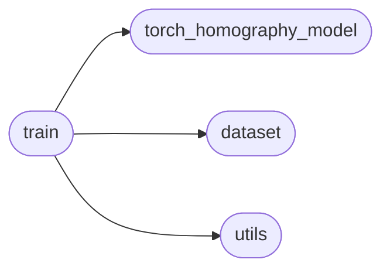
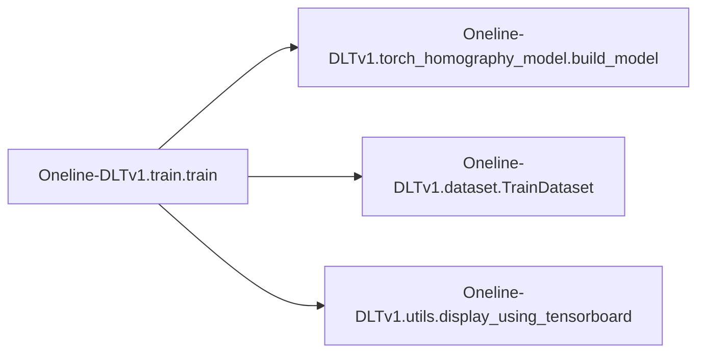

# Oneline-dltv1 Train

[_Documentation generated by Documatic_](https://www.documatic.com)

<!---Documatic-section-Codebase Structure-start--->
## Codebase Structure

<!---Documatic-block-system_architecture-start--->

<!---Documatic-block-system_architecture-end--->

# #
<!---Documatic-section-Codebase Structure-end--->

<!---Documatic-section-Oneline_DLTv1.train.train-start--->
## Oneline-DLTv1.train.train

<!---Documatic-section-train-start--->


### Object Calls

* Oneline-DLTv1.torch_homography_model.build_model
* Oneline-DLTv1.dataset.TrainDataset
* Oneline-DLTv1.utils.display_using_tensorboard

<!---Documatic-block-Oneline_DLTv1.train.train-start--->
<details>
	<summary><code>Oneline_DLTv1.train.train</code> code snippet</summary>

```python
def train(args):
    train_path = os.path.join(exp_name, 'Data/Train_List.txt')
    net = build_model(args.model_name, pretrained=args.pretrained)
    if args.finetune:
        model_path = os.path.join(exp_name, 'models/freeze-mask-first-fintune.pth')
        print(model_path)
        state_dict = torch.load(model_path, map_location='cpu')
        from collections import OrderedDict
        new_state_dict = OrderedDict()
        for (k, v) in state_dict.state_dict().items():
            name_key = k[7:]
            new_state_dict[name_key] = v
        net = build_model(args.model_name)
        model_dict = net.state_dict()
        new_state_dict = {k: v for (k, v) in new_state_dict.items() if k in model_dict.keys()}
        model_dict.update(new_state_dict)
        net.load_state_dict(model_dict)
    net = torch.nn.DataParallel(net)
    if torch.cuda.is_available():
        net = net.cuda()
    train_data = TrainDataset(data_path=train_path, exp_path=exp_name, patch_w=args.patch_size_w, patch_h=args.patch_size_h, rho=16)
    train_loader = DataLoader(dataset=train_data, batch_size=args.batch_size, num_workers=args.cpus, shuffle=True, drop_last=True)
    optimizer = optim.Adam(net.parameters(), lr=args.lr, amsgrad=True, weight_decay=0.0001)
    scheduler = optim.lr_scheduler.ExponentialLR(optimizer, gamma=0.8)
    print('start training')
    score_print_fre = 200
    model_save_fre = 4000
    glob_iter = 0
    for epoch in range(args.max_epoch):
        net.train()
        loss_sigma = 0.0
        loss_sigma_feature = 0.0
        scheduler.step()
        print(epoch, 'lr={:.6f}'.format(scheduler.get_lr()[0]))
        for (i, batch_value) in enumerate(train_loader):
            if glob_iter % model_save_fre == 0 and glob_iter != 0:
                filename = str(args.model_name) + '_iter_' + str(glob_iter) + '.pth'
                model_save_path = os.path.join(MODEL_SAVE_DIR, filename)
                torch.save(net, model_save_path)
                for (name, layer) in net.named_parameters():
                    if layer.requires_grad == True:
                        writer.add_histogram(name + '_grad', layer.grad.cpu().data.numpy(), glob_iter)
                        writer.add_histogram(name + '_data', layer.cpu().data.numpy(), glob_iter)
            org_imges = batch_value[0].float()
            input_tesnors = batch_value[1].float()
            patch_indices = batch_value[2].float()
            h4p = batch_value[3].float()
            I = org_imges[:, 0, ...]
            I = I[:, np.newaxis, ...]
            I2_ori_img = org_imges[:, 1, ...]
            I2_ori_img = I2_ori_img[:, np.newaxis, ...]
            I1 = input_tesnors[:, 0, ...]
            I1 = I1[:, np.newaxis, ...]
            I2 = input_tesnors[:, 1, ...]
            I2 = I2[:, np.newaxis, ...]
            if torch.cuda.is_available():
                input_tesnors = input_tesnors.cuda()
                patch_indices = patch_indices.cuda()
                h4p = h4p.cuda()
                I = I.cuda()
                I2_ori_img = I2_ori_img.cuda()
                I2 = I2.cuda()
            optimizer.zero_grad()
            batch_out = net(org_imges, input_tesnors, h4p, patch_indices)
            loss_feature = batch_out['feature_loss'].mean()
            pred_I2 = batch_out['pred_I2_d']
            I2_dataMat_CnnFeature = batch_out['patch_2_res_d']
            pred_I2_dataMat_CnnFeature = batch_out['pred_I2_CnnFeature_d']
            triMask = batch_out['mask_ap_d']
            loss_map = batch_out['feature_loss_mat_d']
            total_loss = loss_feature
            total_loss.backward()
            optimizer.step()
            loss_sigma += total_loss.item()
            loss_sigma_feature += loss_feature.item()
            if i % score_print_fre == 0 and i != 0:
                loss_avg_feature = loss_sigma_feature / score_print_fre
                loss_sigma = 0.0
                loss_sigma_feature = 0.0
                print('Training: Epoch[{:0>3}/{:0>3}] Iteration[{:0>3}]/[{:0>3}] Feature Loss: {:.4f} lr={:.8f}'.format(epoch + 1, args.max_epoch, i + 1, len(train_loader), loss_avg_feature, scheduler.get_lr()[0]))
            glob_iter += 1
            if glob_iter % 200 == 0:
                display_using_tensorboard(I, I2_ori_img, I2, pred_I2, I2_dataMat_CnnFeature, pred_I2_dataMat_CnnFeature, triMask, loss_map, writer)
            writer.add_scalars('Loss_group', {'feature_loss': loss_feature.item()}, glob_iter)
            writer.add_scalar('learning rate', scheduler.get_lr()[0], glob_iter)
    print('Finished Training')
```
</details>
<!---Documatic-block-Oneline_DLTv1.train.train-end--->
<!---Documatic-section-train-end--->

# #
<!---Documatic-section-Oneline_DLTv1.train.train-end--->

[_Documentation generated by Documatic_](https://www.documatic.com)