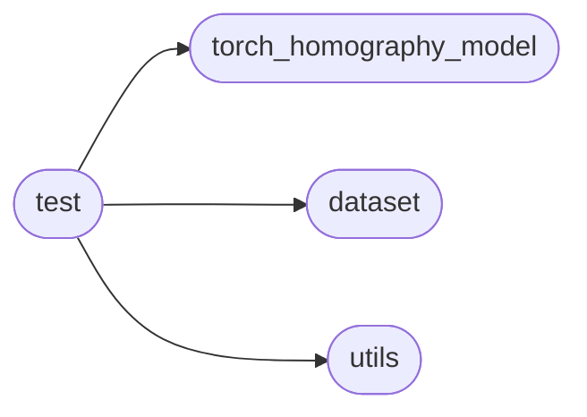
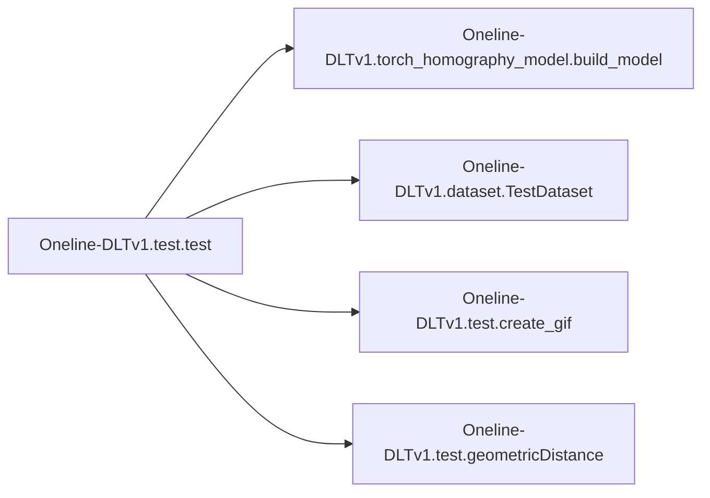

# Oneline-dltv1 Test

[_Documentation generated by Documatic_](https://www.documatic.com)

<!---Documatic-section-Codebase Structure-start--->
## Codebase Structure

<!---Documatic-block-system_architecture-start--->

<!---Documatic-block-system_architecture-end--->

# #
<!---Documatic-section-Codebase Structure-end--->

<!---Documatic-section-Oneline_DLTv1.test.geometricDistance-start--->
## Oneline-DLTv1.test.geometricDistance

<!---Documatic-section-geometricDistance-start--->
<!---Documatic-block-Oneline_DLTv1.test.geometricDistance-start--->
<details>
	<summary><code>Oneline_DLTv1.test.geometricDistance</code> code snippet</summary>

```python
def geometricDistance(correspondence, h):
    p1 = np.transpose(np.matrix([correspondence[0][0], correspondence[0][1], 1]))
    estimatep2 = np.dot(h, p1)
    estimatep2 = 1 / estimatep2.item(2) * estimatep2
    p2 = np.transpose(np.matrix([correspondence[1][0], correspondence[1][1], 1]))
    error = p2 - estimatep2
    return np.linalg.norm(error)
```
</details>
<!---Documatic-block-Oneline_DLTv1.test.geometricDistance-end--->
<!---Documatic-section-geometricDistance-end--->

# #
<!---Documatic-section-Oneline_DLTv1.test.geometricDistance-end--->

<!---Documatic-section-Oneline_DLTv1.test.create_gif-start--->
## Oneline-DLTv1.test.create_gif

<!---Documatic-section-create_gif-start--->
<!---Documatic-block-Oneline_DLTv1.test.create_gif-start--->
<details>
	<summary><code>Oneline_DLTv1.test.create_gif</code> code snippet</summary>

```python
def create_gif(image_list, gif_name, duration=0.35):
    frames = []
    for image_name in image_list:
        frames.append(image_name)
    imageio.mimsave(gif_name, frames, 'GIF', duration=0.5)
    return
```
</details>
<!---Documatic-block-Oneline_DLTv1.test.create_gif-end--->
<!---Documatic-section-create_gif-end--->

# #
<!---Documatic-section-Oneline_DLTv1.test.create_gif-end--->

<!---Documatic-section-Oneline_DLTv1.test.test-start--->
## Oneline-DLTv1.test.test

<!---Documatic-section-test-start--->


### Object Calls

* Oneline-DLTv1.torch_homography_model.build_model
* Oneline-DLTv1.dataset.TestDataset
* Oneline-DLTv1.test.create_gif
* Oneline-DLTv1.test.geometricDistance

<!---Documatic-block-Oneline_DLTv1.test.test-start--->
<details>
	<summary><code>Oneline_DLTv1.test.test</code> code snippet</summary>

```python
def test(args):
    RE = ['0000011', '0000016', '00000147', '00000155', '00000158', '00000107', '00000239', '0000030']
    LT = ['0000038', '0000044', '0000046', '0000047', '00000238', '00000177', '00000188', '00000181']
    LL = ['0000085', '00000100', '0000091', '0000092', '00000216', '00000226']
    SF = ['00000244', '00000251', '0000026', '0000034', '00000115']
    LF = ['00000104', '0000031', '0000035', '00000129', '00000141', '00000200']
    MSE_RE = []
    MSE_LT = []
    MSE_LL = []
    MSE_SF = []
    MSE_LF = []
    exp_name = os.path.abspath(os.path.join(os.path.dirname('__file__'), os.path.pardir))
    work_dir = os.path.join(exp_name, 'Data')
    pair_list = list(open(os.path.join(work_dir, 'Test_List.txt')))
    npy_path = os.path.join(work_dir, 'Coordinate/')
    result_name = 'exp_result_Oneline-FastDLT'
    result_files = os.path.join(exp_name, result_name)
    if not os.path.exists(result_files):
        os.makedirs(result_files)
    result_txt = 'result_ours_exp.txt'
    res_txt = os.path.join(result_files, result_txt)
    f = open(res_txt, 'w')
    net = build_model(args.model_name, pretrained=args.pretrained)
    if args.finetune == True:
        model_path = os.path.join(exp_name, 'models/freeze-mask-first-fintune.pth')
        print(model_path)
        state_dict = torch.load(model_path, map_location='cpu')
        from collections import OrderedDict
        new_state_dict = OrderedDict()
        for (k, v) in state_dict.state_dict().items():
            namekey = k[7:]
            new_state_dict[namekey] = v
        net = build_model(args.model_name)
        model_dict = net.state_dict()
        new_state_dict = {k: v for (k, v) in new_state_dict.items() if k in model_dict.keys()}
        model_dict.update(new_state_dict)
        net.load_state_dict(model_dict)
    net = torch.nn.DataParallel(net)
    if torch.cuda.is_available():
        net = net.cuda()
    M_tensor = torch.tensor([[args.img_w / 2.0, 0.0, args.img_w / 2.0], [0.0, args.img_h / 2.0, args.img_h / 2.0], [0.0, 0.0, 1.0]])
    if torch.cuda.is_available():
        M_tensor = M_tensor.cuda()
    M_tile = M_tensor.unsqueeze(0).expand(1, M_tensor.shape[-2], M_tensor.shape[-1])
    M_tensor_inv = torch.inverse(M_tensor)
    M_tile_inv = M_tensor_inv.unsqueeze(0).expand(1, M_tensor_inv.shape[-2], M_tensor_inv.shape[-1])
    test_data = TestDataset(data_path=exp_name, patch_w=args.patch_size_w, patch_h=args.patch_size_h, rho=16, WIDTH=args.img_w, HEIGHT=args.img_h)
    test_loader = DataLoader(dataset=test_data, batch_size=1, num_workers=0, shuffle=False, drop_last=True)
    print('start testing')
    net.eval()
    for (i, batch_value) in enumerate(test_loader):
        img_pair = pair_list[i]
        pari_id = img_pair.split(' ')
        npy_name = pari_id[0].split('/')[1] + '_' + pari_id[1].split('/')[1][:-1] + '.npy'
        npy_id = npy_path + npy_name
        video_name = img_pair.split('/')[0]
        org_imges = batch_value[0].float()
        input_tesnors = batch_value[1].float()
        patch_indices = batch_value[2].float()
        h4p = batch_value[3].float()
        print_img_1 = batch_value[4]
        print_img_2 = batch_value[5]
        print_img_1_d = print_img_1.cpu().detach().numpy()[0, ...]
        print_img_2_d = print_img_2.cpu().detach().numpy()[0, ...]
        print_img_1_d = np.transpose(print_img_1_d, [1, 2, 0])
        print_img_2_d = np.transpose(print_img_2_d, [1, 2, 0])
        if torch.cuda.is_available():
            input_tesnors = input_tesnors.cuda()
            patch_indices = patch_indices.cuda()
            h4p = h4p.cuda()
            print_img_1 = print_img_1.cuda()
        batch_out = net(org_imges, input_tesnors, h4p, patch_indices)
        H_mat = batch_out['H_mat']
        output_size = (args.img_h, args.img_w)
        H_point = H_mat.squeeze(0)
        H_point = H_point.cpu().detach().numpy()
        H_point = np.linalg.inv(H_point)
        H_point = 1.0 / H_point.item(8) * H_point
        point_dic = np.load(npy_id, allow_pickle=True)
        data = point_dic.item()
        err_img = 0.0
        for j in range(6):
            points_LR = data['matche_pts'][j]
            points_RL = [points_LR[1], points_LR[0]]
            err_LR = geometricDistance(points_LR, H_point)
            err_RL = geometricDistance(points_RL, H_point)
            err = min(err_LR, err_RL)
            err_img += err
        err_avg = err_img / 6
        name = '0' * (8 - len(str(i))) + str(i)
        line = name + ':' + str(err_avg) + '\n'
        f.write(line)
        print('{}:{}'.format(i, err_avg))
        if video_name in RE:
            MSE_RE.append(err_avg)
        elif video_name in LT:
            MSE_LT.append(err_avg)
        elif video_name in LL:
            MSE_LL.append(err_avg)
        elif video_name in SF:
            MSE_SF.append(err_avg)
        elif video_name in LF:
            MSE_LF.append(err_avg)
        H_mat = torch.matmul(torch.matmul(M_tile_inv, H_mat), M_tile)
        (pred_full, _) = trans(print_img_1, H_mat, output_size)
        pred_full = pred_full.cpu().detach().numpy()[0, ...]
        pred_full = pred_full.astype(np.uint8)
        pred_full = cv2.cvtColor(pred_full, cv2.COLOR_BGR2RGB)
        print_img_1_d = cv2.cvtColor(print_img_1_d, cv2.COLOR_BGR2RGB)
        print_img_2_d = cv2.cvtColor(print_img_2_d, cv2.COLOR_BGR2RGB)
        input_list = [print_img_1_d, print_img_2_d]
        output_list = [pred_full, print_img_2_d]
        create_gif(input_list, os.path.join(result_files, name + '_input_[' + result_name + '].gif'))
        create_gif(output_list, os.path.join(result_files, name + '_output_[' + result_name + '].gif'))
    MSE_RE_avg = np.mean(MSE_RE)
    MSE_LT_avg = np.mean(MSE_LT)
    MSE_LL_avg = np.mean(MSE_LL)
    MSE_SF_avg = np.mean(MSE_SF)
    MSE_LF_avg = np.mean(MSE_LF)
    res = {'RE': MSE_RE_avg, 'LT': MSE_LT_avg, 'LL': MSE_LL_avg, 'SF': MSE_SF_avg, 'LF': MSE_LF_avg}
    print(res)
    f.write(str(res))
    return res
```
</details>
<!---Documatic-block-Oneline_DLTv1.test.test-end--->
<!---Documatic-section-test-end--->

# #
<!---Documatic-section-Oneline_DLTv1.test.test-end--->

[_Documentation generated by Documatic_](https://www.documatic.com)